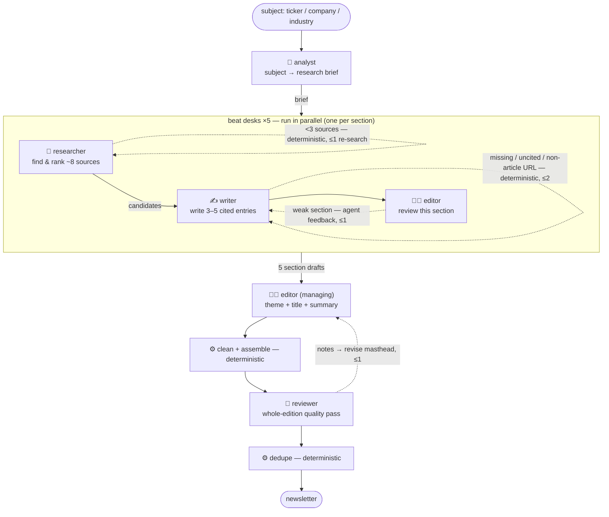

# agentic-mediapulse

A simpler, agentic version of [MediaPulse](https://github.com/hyperjumptech/mediapulse). Give it a subject — a stock ticker, a company name, or an industry theme — and a newsroom of focused agents researches, writes, and edits a locale-aware briefing across five editorial sections, with every claim traced to a real source.

## Setup

1. Create and activate the environment:

   ```
   conda env create -f environment.yml
   conda activate agentic-mediapulse
   ```

2. Install dev dependencies (includes ruff for linting):

   ```
   pip install -r requirements-dev.txt
   ```

3. Copy the env file and fill in your keys:

   ```
   cp .env.example .env
   ```

## Environment Variables

| Variable                  | Description                                                           | Is Required? |
| ------------------------- | --------------------------------------------------------------------- | ------------ |
| `OPENAI_API_KEY`          | Your API key                                                          | Yes          |
| `OPENAI_BASE_URL`         | Leave blank for OpenAI, or point to an OpenAI-compatible gateway      | Yes          |
| `OPENAI_MODEL`            | Default model for every agent (e.g. `gpt-4.1-mini`)                   | Yes          |
| `SERPER_API_KEY`          | Serper key (serper.dev) for news search and page scraping             | Yes          |
| `MEDIAPULSE_DATABASE_URL` | Postgres connection string (read-only)                                | Yes          |
| `DATABASE_URL`            | App Postgres (read-write): archived newsletters and agent memory      | No           |
| `RESEND_API_KEY`          | Resend key for email delivery                                         | Yes          |
| `EMAIL_FROM`              | Sender address, e.g. `MediaPulse <hello@example.com>`                 | Yes          |
| `SECRET_KEY`              | Required on every API request (`X-API-Key` header)                    | Yes          |
| `ANALYST_MODEL`           | Model override for the analyst — falls back to `OPENAI_MODEL`         | No           |
| `RESEARCHER_MODEL`        | Model override for the researcher — falls back to `OPENAI_MODEL`      | No           |
| `WRITER_MODEL`            | Model override for the writer — falls back to `OPENAI_MODEL`          | No           |
| `EDITOR_MODEL`            | Model override for the editor — falls back to `OPENAI_MODEL`          | No           |
| `MANAGING_EDITOR_MODEL`   | Model override for the managing editor — falls back to `OPENAI_MODEL` | No           |
| `REVIEWER_MODEL`          | Model override for the reviewer — falls back to `OPENAI_MODEL`        | No           |

## CLI

```
python src/app.py run                                   # dry-run the full campaign
python src/app.py run --send                            # email all subscribers

python src/app.py test --email=you@example.com          # dry-run one user's tickers
python src/app.py test --email=you@example.com --send   # email that user
```

## API

```
python src/api.py   # http://localhost:8000  (docs at /docs)
```

Both endpoints return `202` immediately and run in the background. Default is dry-run; pass `dry_run=false` to deliver.

| Endpoint                                         | Description                                                       |
| ------------------------------------------------ | ----------------------------------------------------------------- |
| `POST /run?dry_run=false`                        | Full campaign — every followed ticker, emailed to all subscribers |
| `POST /test?email=you@example.com&dry_run=false` | One user's followed tickers, emailed only to them                 |

Every request must include the `X-API-Key` header:

```
curl -X POST "http://localhost:8000/test?email=you@example.com" \
     -H "X-API-Key: $SECRET_KEY"
```

## How it works



### Agents

| Agent               | Job                                                                                  |
| ------------------- | ------------------------------------------------------------------------------------ |
| **analyst**         | Resolves the subject into a brief: name, sector, market, locale, key players, themes |
| **researcher** ×5   | Finds and ranks the best ~8 articles for one beat                                    |
| **writer** ×5       | Writes 3–5 cited entries from the researcher's sources                               |
| **editor**          | Reviews each section draft, then writes the edition title and summary                |
| **managing_editor** | Gap-check roundtable after all beats finish — raises missing angles                  |
| **reviewer**        | Final whole-edition quality pass before publishing                                   |

### Skills

To change how an agent writes or researches, edit its skill file in `src/agents/skills/` — no code changes needed:

| Skill               | Controls                                              |
| ------------------- | ----------------------------------------------------- |
| `subject-profile`   | How the analyst resolves a subject into a brief       |
| `section-research`  | Search strategy, article selection, and summary style |
| `newsletter-format` | Final layout, section order, and title/summary style  |

## Database

Subscriptions and ticker data are read from the [MediaPulse](https://github.com/hyperjumptech/mediapulse) database. Set `MEDIAPULSE_DATABASE_URL` to your MediaPulse Postgres connection string — the schema is defined in that repo.
